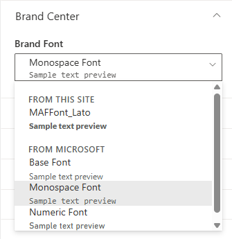
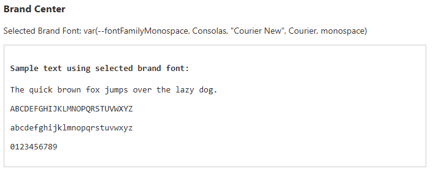

# PropertyFieldBrandFontPicker control

This control generates a font picker that reads from SharePoint Brand Center and allows users to select corporate-approved fonts for their web parts. It supports both Brand Center fonts, system fonts, and custom font tokens with preview capabilities.

**PropertyFieldBrandFontPicker**



**PropertyFieldBrandFontPicker with font preview**



## How to use this control in your solutions

1. Check that you installed the `@pnp/spfx-property-controls` dependency. Check out The [getting started](../../#getting-started) page for more information about installing the dependency.
2. Import the following modules to your component:

```TypeScript
import { PropertyFieldBrandFontPicker } from '@pnp/spfx-property-controls/lib/PropertyFieldBrandFontPicker';
```

3. Create a new property for your web part, for example:

```TypeScript
export interface IPropertyControlsTestWebPartProps {
  brandFont: string;
}
```

4. Add the custom property control to the `groupFields` of the web part property pane configuration:

```TypeScript
PropertyFieldBrandFontPicker('brandFont', {
  label: 'Brand Font',
  initialValue: this.properties.brandFont,
  onSelectionChanged: (fontToken) => {
    this.properties.brandFont = fontToken.value;
    this.onPropertyPaneFieldChanged('brandFont', fontToken.value);
  },
  context: this.context,
  showPreview: true,
  key: 'brandFontFieldId'
})
```

## Using Custom Font Tokens

You can provide your own list of font tokens instead of relying on Brand Center:

```TypeScript
import { IBrandFontToken } from '@pnp/spfx-property-controls/lib/PropertyFieldBrandFontPicker';

const customFontTokens: IBrandFontToken[] = [
  {
    name: 'corporateHeading',
    displayName: 'Corporate Heading Font',
    value: '"Montserrat", sans-serif',
    category: 'custom'
  },
  {
    name: 'corporateBody',
    displayName: 'Corporate Body Font',
    value: '"Open Sans", sans-serif',
    category: 'custom'
  }
];

PropertyFieldBrandFontPicker('brandFont', {
  label: 'Custom Brand Font',
  initialValue: this.properties.brandFont,
  onSelectionChanged: (fontToken) => {
    this.properties.brandFont = fontToken.value;
    this.onPropertyPaneFieldChanged('brandFont', fontToken.value);
  },
  context: this.context,
  customFontTokens: customFontTokens,
  showPreview: true,
  key: 'brandFontFieldId'
})
```

## Implementation

The `PropertyFieldBrandFontPicker` control can be configured with the following properties:

| Property | Type | Required | Description |
| ---- | ---- | ---- | ---- |
| label | string | no | Property field label displayed on top. |
| initialValue | string | no | Initial font value to be selected. |
| onSelectionChanged | function | yes | Callback function when a font is selected. Returns the selected IBrandFontToken. |
| context | BaseComponentContext | yes | The SPFx component context. |
| customFontTokens | IBrandFontToken[] | no | Array of custom font tokens to display instead of Brand Center fonts. |
| showPreview | boolean | no | Whether to display font preview text in the dropdown. Default is true. |
| disabled | boolean | no | Whether the control is disabled. Default is false. |
| onFontTokensLoaded | function | no | Callback function called when font tokens are loaded. |
| loadingErrorMessage | string | no | Custom error message to display when font loading fails. |
| key | string | yes | An UNIQUE key indicates the identity of this control. |

Interface `IBrandFontToken`:

| Property | Type | Required | Description |
| ---- | ---- | ---- | ---- |
| name | string | yes | Unique identifier for the font token. |
| displayName | string | yes | Display name shown in the dropdown. |
| value | string | yes | CSS font-family value (e.g., '"Lato", sans-serif'). |
| preview | string | no | Optional preview text. |
| category | string | no | Category for grouping (e.g., 'site', 'microsoft', 'custom'). |
| fileUrl | string | no | Optional URL to font file or CSS. |

## Example

```TypeScript
import * as React from 'react';
import * as ReactDom from 'react-dom';
import { Version } from '@microsoft/sp-core-library';
import {
  BaseClientSideWebPart,
  IPropertyPaneConfiguration,
  PropertyPaneTextField
} from '@microsoft/sp-webpart-base';

import { PropertyFieldBrandFontPicker } from '@pnp/spfx-property-controls/lib/PropertyFieldBrandFontPicker';

export interface IPropertyControlsTestWebPartProps {
  brandFont: string;
}

export default class PropertyControlsTestWebPart extends BaseClientSideWebPart<IPropertyControlsTestWebPartProps> {

  public render(): void {
    const element: React.ReactElement<IPropertyControlsTestWebPartProps> = React.createElement(
      PropertyControlsTest,
      {
        brandFont: this.properties.brandFont
      }
    );

    ReactDom.render(element, this.domElement);
  }

  protected get propertyPaneConfiguration(): IPropertyPaneConfiguration {
    return {
      pages: [
        {
          header: {
            description: strings.PropertyPaneDescription
          },
          groups: [
            {
              groupName: strings.BasicGroupName,
              groupFields: [
                PropertyFieldBrandFontPicker('brandFont', {
                  label: 'Brand Font',
                  initialValue: this.properties.brandFont,
                  onSelectionChanged: (fontToken) => {
                    this.properties.brandFont = fontToken.value;
                    this.onPropertyPaneFieldChanged('brandFont', fontToken.value);
                  },
                  context: this.context,
                  showPreview: true,
                  key: 'brandFontFieldId'
                })
              ]
            }
          ]
        }
      ]
    };
  }
}
```


