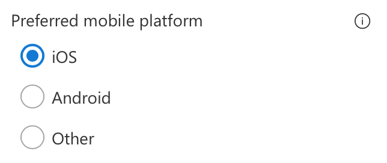

# PropertyFieldChoiceGroupWithCallout control

This control generates a choice group control with a callout.

**PropertyFieldChoiceGroupWithCallout rendering**




**PropertyFieldChoiceGroupWithCallout callout opened**


## How to use this control in your solutions

1. Check that you installed the `@pnp/spfx-property-controls` dependency. Check out The [getting started](../getting-started) page for more information about installing the dependency.
2. Import the following modules to your component:

```TypeScript
import { CalloutTriggers } from '@pnp/spfx-property-controls/lib/PropertyFieldHeader';
import { PropertyFieldChoiceGroupWithCallout } from '@pnp/spfx-property-controls/lib/PropertyFieldChoiceGroupWithCallout';
```

3. Create a new property for your web part, for example:

```TypeScript
export interface IPropertyControlsTestWebPartProps {
  choiceGroupWithCalloutValue: string;
}
```

4. Add the custom property control to the `groupFields` of the web part property pane configuration:

```TypeScript
PropertyFieldChoiceGroupWithCallout('choiceGroupWithCalloutValue', {
  calloutContent: React.createElement('div', {}, 'Select preferrable mobile platform'),
  calloutTrigger: CalloutTriggers.Hover,
  key: 'choiceGroupWithCalloutFieldId',
  label: 'Preferred mobile platform',
  options: [{
    key: 'iOS',
    text: 'iOS',
    checked: this.properties.choiceGroupWithCalloutValue === 'iOS'
  }, {
    key: 'Android',
    text: 'Android',
    checked: this.properties.choiceGroupWithCalloutValue === 'Android'
  }, {
    key: 'Other',
    text: 'Other',
    checked: this.properties.choiceGroupWithCalloutValue === 'Other'
  }]
})
```

## Implementation

The `PropertyFieldChoiceGroupWithCallout` control uses the same implementation as the default `PropertyPaneChoiceGroup` and has the following additional properties:

| Property | Type | Required | Description |
| ---- | ---- | ---- | ---- |
| calloutContent | React.ReactNode | no | Callout content - any HTML |
| calloutWidth | number | no | Custom width for callout including borders. If value is 0, no width is applied. |
| calloutTrigger | CalloutTriggers | no | Event to show the callout |
| gapSpace | number | no | The gap between the callout and the target |

Enum `CalloutTriggers`

| Name | Description |
| ---- | ---- |
| Click | Shows the callout when you hover over the icon |
| Hover | Shows the callout when you click on the icon |


