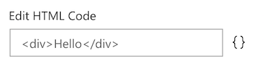

# PropertyFieldCodeEditor control

This control generates a code editor which can be used to add custom styling or content to your web part.

**PropertyFieldCodeEditor**



**PropertyFieldCodeEditor editing experience**


## How to use this control in your solutions

1. Check that you installed the `@pnp/spfx-property-controls` dependency. Check out The [getting started](../../#getting-started) page for more information about installing the dependency.
2. Import the following modules to your component:

```TypeScript
import { PropertyFieldCodeEditor, PropertyFieldCodeEditorLanguages } from '@pnp/spfx-property-controls/lib/PropertyFieldCodeEditor';
```

3. Create a new property for your web part, for example:

```TypeScript
export interface IPropertyControlsTestWebPartProps {
  htmlCode: string;
}
```

4. Add the custom property control to the `groupFields` of the web part property pane configuration:

```TypeScript
PropertyFieldCodeEditor('htmlCode', {
  label: 'Edit HTML Code',
  panelTitle: 'Edit HTML Code',
  initialValue: this.properties.htmlCode,
  onPropertyChange: this.onPropertyPaneFieldChanged,
  properties: this.properties,
  disabled: false,
  key: 'codeEditorFieldId',
  language: PropertyFieldCodeEditorLanguages.HTML,
  options: {
    wrap: true,
    fontSize: 20,
    // more options
  }
})
```

## Implementation

The `PropertyFieldCodeEditor` control can be configured with the following properties:

| Property | Type | Required | Description |
| ---- | ---- | ---- | ---- |
| label | string | yes | Property field label displayed on top. |
| disabled | boolean | no | Specify if the control needs to be disabled. |
| panelTitle | string | yes | Title of the code editor panel. |
| initialValue | string | no | Defines the initial code. |
| language | PropertyFieldCodeEditorLanguages | no | Sets the language on the code editor. |
| properties | any | yes | Parent web part properties, this object is use to update the property value.  |
| onPropertyChange | function | yes | Defines a onPropertyChange function to raise when the date gets changed. |
| key | string | yes | An unique key that indicates the identity of this control. |
| options | AceOptions | no | [Additional properties](https://github.com/ajaxorg/ace/wiki/Configuring-Ace) available to the Ace editor. |

Enum `PropertyFieldCodeEditorLanguages`

| Name |
| ---- |
| css |
| JavaScript |
| JSON |
| Handlebars |
| HTML |
| Plain Text |
| Sass |
| TypeScript |
| XML |


