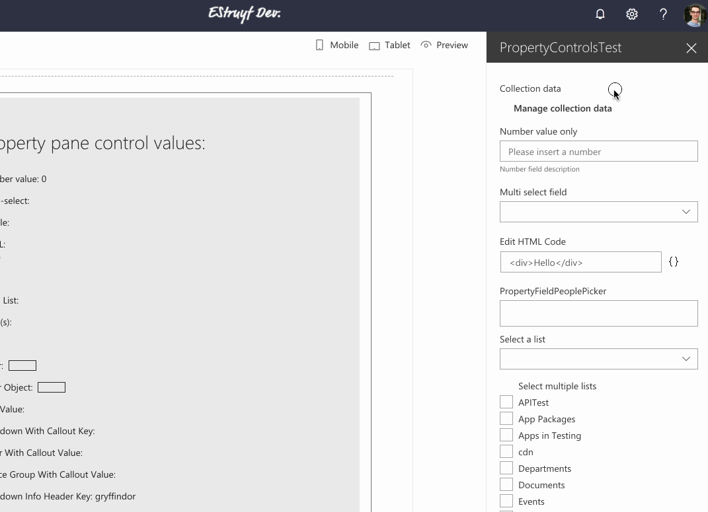

# PropertyFieldCollectionData control

This property field control gives you the ability to insert a list / collection data which can be used in your web part. For example: you want to specify multiple locations for showing a weather information.

The control allows you to specify multiple data types like: string, number, boolean, or dropdown.

**PropertyFieldCollectionData**



The type of data you get returned depends on the fields you defined. For the example above, the data looks like this:

```json
[
  {"Title":"Person","Lastname":"1","Age":"42","City":"helsinki","Sign":true},
  {"Title":"Person","Lastname":"2","Age":"42","City":"helsinki","Sign":true}
]
```

## How to use this control in your solutions

1. Check that you installed the `@pnp/spfx-property-controls` dependency. Check out The [getting started](../#getting-started) page for more information about installing the dependency.
2. Import the following modules to your component:

```TypeScript
import { PropertyFieldCollectionData, CustomCollectionFieldType } from '@pnp/spfx-property-controls/lib/PropertyFieldCollectionData';
```

3. Create a new property for your web part, for example:

```TypeScript
export interface IPropertyControlsTestWebPartProps {
  collectionData: any[];
}
```

4. Add the custom property control to the `groupFields` of the web part property pane configuration:

```TypeScript
PropertyFieldCollectionData("collectionData", {
  key: "collectionData",
  label: "Collection data",
  panelHeader: "Collection data panel header",
  manageBtnLabel: "Manage collection data",
  value: this.properties.collectionData,
  fields: [
    {
      id: "Title",
      title: "Firstname",
      type: CustomCollectionFieldType.string,
      required: true
    },
    {
      id: "Lastname",
      title: "Lastname",
      type: CustomCollectionFieldType.string
    },
    {
      id: "Age",
      title: "Age",
      type: CustomCollectionFieldType.number,
      required: true
    },
    {
      id: "City",
      title: "Favorite city",
      type: CustomCollectionFieldType.dropdown,
      options: [
        {
          key: "antwerp",
          text: "Antwerp"
        },
        {
          key: "helsinki",
          text: "Helsinki"
        },
        {
          key: "montreal",
          text: "Montreal"
        }
      ],
      required: true
    },
    {
      id: "Sign",
      title: "Signed",
      type: CustomCollectionFieldType.boolean
    }
  ],
  disabled: false
})
```

### Sample of custom field rendering

Here is an example of how you can render your own controls in the `PropertyFieldCollectionData` control:

```TypeScript
{
  id: "customFieldId",
  title: "Custom Field",
  type: CustomCollectionFieldType.custom,
  onCustomRender: (field, value, onUpdate) => {
    return (
      React.createElement("div", null,
        React.createElement("input", { value: value, onChange: (event: React.FormEvent<HTMLInputElement>) => onUpdate(field.id, event.currentTarget.value) }), " 🎉"
      )
    );
  }
}
```

## Implementation

The `PropertyFieldCollectionData` control can be configured with the following properties:

| Property | Type | Required | Description | Default Value |
| ---- | ---- | ---- | ---- | ---- |
| key | string | yes | An unique key that indicates the identity of this control. | |
| label | string | yes | Property field label displayed on top. | |
| panelHeader | string | yes | Label to be used as the header in the panel. | |
| panelDescription | string | no | Property that allows you to specify a description in the collection panel. | |
| manageBtnLabel | string | yes | Label of the button to open the panel. | |
| fields | ICustomCollectionField[] | yes | The fields to be used for the list of collection data. | |
| value | string | yes | The collection data value. | |
| enableSorting | boolean | no | Specify if you want to be able to sort the items in the collection. | false |
| disabled | boolean | no | Specify if the control is disabled. | false |

Interface `ICustomCollectionField`

| Property | Type | Required | Description |
| ---- | ---- | ---- | ---- |
| id | string | yes | ID of the field. |
| title | string | yes | Title of the field. This will be used for the label in the table. |
| type | CustomCollectionFieldType | yes | Specifies the type of field to render. |
| required | boolean | no | Specify if the field is required. |
| options | [IDropdownOption[]](https://developer.microsoft.com/en-us/fabric#/components/dropdown) | no | Dropdown options. Only necessary when dropdown type is used. |
| onRenderOption | IRenderFunction<ISelectableOption> | no | Dropdown custom options render method. Only for the **dropdown** field type. |
| placeholder | string | no | Placehoder text which will be used for the input field. If not provided the input title will be used. |
| defaultValue | any | no | Specify a default value for the input field. |
| deferredValidationTime | number | no | Field will start to validate after users stop typing for `deferredValidationTime` milliseconds. Default: 200ms. |
| onGetErrorMessage | (value: any, index: number, crntItem: any): string \| Promise<string> | no | The method is used to get the validation error message and determine whether the input value is valid or not. It provides you the current row index and the item you are currently editing. |
| onCustomRender | (field: ICustomCollectionField, value: any, onUpdate: (fieldId: string, value: any) => void) => JSX.Element | no | This property is only required if you are using the `custom` field type and it can be used to specify the custom rendering of your control in the collection data. |

Enum `CustomCollectionFieldType`

| Type | Description |
| ---- | ---- |
| string | Text field |
| number | Number field |
| boolean | Checkbox |
| dropdown | Dropdown field. You will have to specify the `options` property when using this field type |
| fabricIcon | Name of the [Office UI Fabric icon](https://developer.microsoft.com/en-us/fabric#/styles/icons) |
| url | URL field |
| custom | This gives you control over the whole field rendering. Be sure to provide the `onCustomRender` method to render your control in the collection data. |


