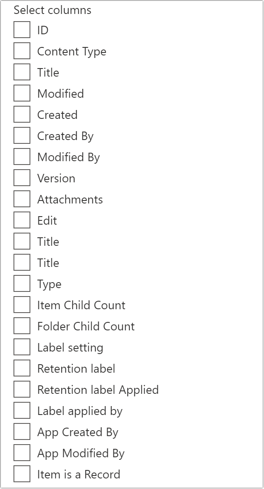

# PropertyFieldColumnPicker control

This control generates a column picker field that can be used in the property pane of your SharePoint Framework web parts.

The control automatically retrieves the columns for a given SharePoint list:




## How to use this control in your solutions

1. Check that you installed the `@pnp/spfx-property-controls` dependency. Check out The [getting started](../../#getting-started) page for more information about installing the dependency.
2. Import the following modules to your component:

```TypeScript
import { PropertyFieldColumnPicker, PropertyFieldColumnPickerOrderBy } from '@pnp/spfx-property-controls/lib/PropertyFieldColumnPicker';
```

3. You'll probably want to use this control in combination with the [PropertyFieldListPicker](./PropertyFieldListPicker.md). Make sure to select the `multiSelect` prop to `false`, as this control is designed to work with a single list. Store the list id in your web part properties, as follows:
```TypeScript
export interface IPropertyControlsTestWebPartProps {
  list: string; // Stores the list ID
}
```

3. Create a new property for your web part, as indicated between the `BEGIN:` and `END:` comments below:

```TypeScript
export interface IPropertyControlsTestWebPartProps {
  list: string; // Stores the list ID

  // BEGIN: Added
  column: string; // Stores the single column property (property can be configured)
  // END: Added

  // BEGIN: Added
  multiColumn: string; // Stores the multi column property (property can be configured)
  // END: Added
}
```

4. Add the custom property control to the `groupFields` of the web part property pane configuration:

```TypeScript
// Single column selection returning 'Internal Name' of the selected column
PropertyFieldColumnPicker('column', {
    label: 'Select a column',
    context: this.context,
    selectedColumn: this.properties.column,
    listId: this.properties.singleListFiltered,
    disabled: false,
    orderBy: PropertyFieldColumnPickerOrderBy.Title,
    onPropertyChange: this.onPropertyPaneFieldChanged.bind(this),
    properties: this.properties,
    onGetErrorMessage: null,
    deferredValidationTime: 0,
    key: 'columnPickerFieldId',
    displayHiddenColumns: false,
    columnReturnProperty: IColumnReturnProperty["Internal Name"]
})

// Multi column selection returning the 'Title' of the selected columns
PropertyFieldColumnPicker('multiColumn', {
    label: 'Select columns',
    context: this.context,
    selectedColumn: this.properties.multiColumn,
    listId: this.properties.singleListFiltered,
    disabled: false,
    orderBy: PropertyFieldColumnPickerOrderBy.Title,
    onPropertyChange: this.onPropertyPaneFieldChanged.bind(this),
    properties: this.properties,
    onGetErrorMessage: null,
    deferredValidationTime: 0,
    key: 'multiColumnPickerFieldId',
    displayHiddenColumns: false,
    columnReturnProperty: IColumnReturnProperty.Title,
    multiSelect: true
})
```

## Implementation

The `PropertyFieldColumnPicker` control can be configured with the following properties:

| Property | Type | Required | Description |
| ---- | ---- | ---- | ---- |
| label | string | yes | Property field label displayed on top. |
| listId | string | yes | The ID of the list or library you wish to select a column(s) from. |
| disabled | boolean | no | Specify if the control needs to be disabled. |
| context | BaseComponentContext | yes | Context of the current web part. |
| selectedColumn | string \| string[] | no | Initial selected column(s) of the control. |
| orderBy | PropertyFieldColumnPickerOrderBy | no | Specify the property on which you want to order the retrieve set of columns. |
multiSelect | boolean | no | Specify if you want to have a single or multi-column picker. By default this is set to `false` (single column picker).
| webAbsoluteUrl | string | no | Absolute Web Url of target site (user requires permissions) |
| onPropertyChange | function | yes | Defines a onPropertyChange function to raise when the date gets changed. |
| properties | any | yes | Parent web part properties, this object is use to update the property value.  |
| key | string | yes | An unique key that indicates the identity of this control. |
| onGetErrorMessage | function | no | The method is used to get the validation error message and determine whether the input value is valid or not. See [this documentation](https://dev.office.com/sharepoint/docs/spfx/web-parts/guidance/validate-web-part-property-values) to learn how to use it. |
| deferredValidationTime | number | no | Control will start to validate after users stop typing for `deferredValidationTime` milliseconds. Default value is 200. |
| columnsToExclude | string[] | no | Defines columns by which should be excluded from the column picker control. You can specify column titles or IDs |
| filter | string | no | Filter columns from OData query. |
| onColumnsRetrieved | (columns: ISPColumn[]) => PromiseLike<ISPColumn[]> \| ISPColumn[] | no | Callback that is called before the dropdown is populated. |
displayHiddenColumns | boolean | no | Hidden columns to be returned or not. By default this is set to `false` (No Hidden columns) |
columnReturnProperty | IColumnReturnProperty | no | Property to be returned for the selected column(s). |

Enum `PropertyFieldColumnPickerOrderBy`

| Name | Description |
| ---- | ---- |
| Id | Sort by column ID |
| Title | Sort by column title |

Enum `IColumnReturnProperty`

| Name | Description |
| ---- | ---- |
| Id | Column `ID` to be returned |
| Title | Column `Title` to be returned |
| Internal Name | Column `InternalName` to be returned | 


