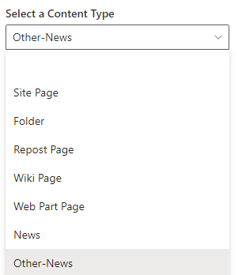
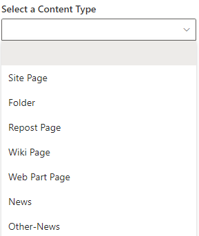
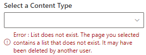

# PropertyFieldContentTypePicker control

This control generates a ContentType picker field that can be used in the property pane of your SharePoint Framework web parts.

The control automatically retrieves the ContentType for a given SharePoint Site or selected SharePoint list:



## How to use this control in your solutions

1. Check that you installed the `@pnp/spfx-property-controls` dependency. Check out The [getting started](../../#getting-started) page for more information about installing the dependency.
2. Import the following modules to your component:

```TypeScript
import { PropertyFieldContentTypePicker, PropertyFieldContentTypePickerOrderBy } from '@pnp/spfx-property-controls/lib/PropertyFieldContentTypePicker';
```

3. You'll probably want to use this control in combination with the [PropertyFieldListPicker](./PropertyFieldListPicker.md). Make sure to select the `multiSelect` prop to `false`, as this control is designed to work with a single list. Store the list id in your web part properties, as follows:
```TypeScript
export interface IPropertyControlsTestWebPartProps {
  list: string; // Stores the list ID
}
```

3. Create a new property for your web part, as indicated between the `BEGIN:` and `END:` comments below:

```TypeScript
export interface IPropertyControlsTestWebPartProps {
  list: string; // Stores the list ID

  // BEGIN: Added
  view: string; // Stores the view ID
  // END: Added
}
```

4. Add the custom property control to the `groupFields` of the web part property pane configuration:

```TypeScript
PropertyFieldContentTypePicker('contentType', {
  label: 'Select a Content Type',
  context: this.context,
  selectedContentType: this.properties.contentType,
  disabled: false,
  orderBy: PropertyFieldContentTypeOrderBy.Name,
  onPropertyChange: this.onPropertyPaneFieldChanged.bind(this),
  properties: this.properties,
  onGetErrorMessage: null,
  deferredValidationTime: 0,
  key: 'contentTypePickerFieldId'
})

```

5. To fetch the contentTypes of a particular site, change the property pane configuration as follows:

```TypeScript
PropertyFieldContentTypePicker('contentType', {
  label: 'Select a Content Type',
  context: this.context,
  selectedContentType: this.properties.contentType,
  disabled: false,
  webAbsoluteUrl:"https://****.sharepoint.com/sites/*****",
  orderBy: PropertyFieldContentTypeOrderBy.Name,
  onPropertyChange: this.onPropertyPaneFieldChanged.bind(this),
  properties: this.properties,
  onGetErrorMessage: null,
  deferredValidationTime: 0,
  key: 'contentTypePickerFieldId'
})


```

6. To fetch the contentTypes of selected list, change the property pane configuration as follows:

```TypeScript
PropertyFieldContentTypePicker('contentType', {
  label: 'Select a Content Type',
  context: this.context,
  selectedContentType: this.properties.contentType,
  listId: {list-guid} //"0da3b4b7-8ebd-4f15-87ee-afae5cacadad"
  disabled: false,
  orderBy: PropertyFieldContentTypeOrderBy.Name,
  onPropertyChange: this.onPropertyPaneFieldChanged.bind(this),
  properties: this.properties,
  onGetErrorMessage: null,
  deferredValidationTime: 0,
  key: 'contentTypePickerFieldId'
})



```

7. If ListID specified in the propertiesc is not available in the selected site, the control will error out as follows
```TypeScript
PropertyFieldContentTypePicker('contentType', {
  label: 'Select a Content Type',
  context: this.context,
  selectedContentType: this.properties.contentType,
  listId: {list-guid} //"0da3b4b7-8ebd-4f15-87ee-afae5cacadad"
  disabled: false,
  orderBy: PropertyFieldContentTypeOrderBy.Name,
  onPropertyChange: this.onPropertyPaneFieldChanged.bind(this),
  properties: this.properties,
  onGetErrorMessage: null,
  deferredValidationTime: 0,
  key: 'contentTypePickerFieldId'
})



```

## Implementation

The `PropertyFieldViewPicker` control can be configured with the following properties:

| Property | Type | Required | Description |
| ---- | ---- | ---- | ---- |
| label | string | yes | Property field label displayed on top. |
| listId | string | no | The ID of the list or library you wish to select a contentType from. |
| disabled | boolean | no | Specify if the control needs to be disabled. |
| context | BaseComponentContext | yes | Context of the current web part. |
| selectedContentType | string | string[] | no | IDefines ContentType titles which should be excluded from the ContentType picker control. |
| orderBy | PropertyFieldContentTypeOrderBy | no | Specify the property on which you want to order the retrieve set of ContentTypes. |
| webAbsoluteUrl | string | no | Absolute Web Url of target site (user requires permissions) |
| onPropertyChange | function | yes | Defines a onPropertyChange function to raise when the date gets changed. |
| properties | any | yes | Parent web part properties, this object is use to update the property value.  |
| key | string | yes | An unique key that indicates the identity of this control. |
| onGetErrorMessage | function | no | The method is used to get the validation error message and determine whether the input value is valid or not. See [this documentation](https://dev.office.com/sharepoint/docs/spfx/web-parts/guidance/validate-web-part-property-values) to learn how to use it. |
| deferredValidationTime | number | no | Control will start to validate after users stop typing for `deferredValidationTime` milliseconds. Default value is 200. |
| contentTypesToExclude | string[] | no | Defines contentTypes by which should be excluded from the contentType picker control. You can specify contentType titles or IDs |
| filter | string | no | Filter contentTypes from OData query. |
| onContentTypesRetrieved | (contentType: ISPContentType[]) => PromiseLike<ISPContentType[]> \| ISPContentType[] | no | Callback that is called before the dropdown is populated. |


Enum `PropertyFieldContentTypePickerOrderBy`

| Name | Description |
| ---- | ---- |
| Id | Sort by view ID |
| Title | Sort by view title |


