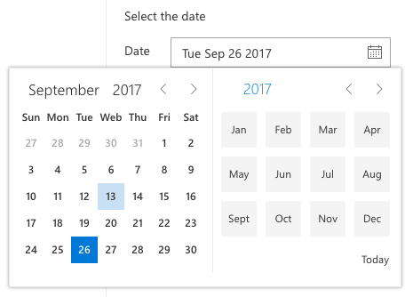

# PropertyFieldDateTimePicker control

This control generates a Date and Time picker field that can be used in the property pane of your SharePoint Framework web parts.

The control can be configured to be date only or date and time.

**Date only**


**Date picker**



**Date and time**


## How to use this control in your solutions

1. Check that you installed the `@pnp/spfx-property-controls` dependency. Check out the [getting started](../getting-started) page for more information about installing the dependency.
2. Import the following modules to your component:

```TypeScript
import { PropertyFieldDateTimePicker, DateConvention, TimeConvention } from '@pnp/spfx-property-controls/lib/PropertyFieldDateTimePicker';
```

3. Create a new property for your web part, for example:

```TypeScript
import { IDateTimeFieldValue } from "@pnp/spfx-property-controls/lib/PropertyFieldDateTimePicker";

export interface IPropertyControlsTestWebPartProps {
  datetime: IDateTimeFieldValue;
}
```

4. Add the custom property control to the `groupFields` of the web part property pane configuration:

```TypeScript
PropertyFieldDateTimePicker('datetime', {
  label: 'Select the date and time',
  initialDate: this.properties.datetime,
  dateConvention: DateConvention.DateTime,
  timeConvention: TimeConvention.Hours12,
  onPropertyChange: this.onPropertyPaneFieldChanged,
  properties: this.properties,
  onGetErrorMessage: null,
  deferredValidationTime: 0,
  key: 'dateTimeFieldId'
})
```

## Implementation

The `PropertyFieldDateTimePicker` control can be configured with the following properties:

| Property | Type | Required | Description |
| ---- | ---- | ---- | ---- |
| label | string | yes | Property field label displayed on top. |
| disabled | boolean | no | Specify if the control needs to be disabled. |
| initialData | IDateTimeFieldValue | yes | Initial date and time value of the control. |
| formatData | function | no | Defines a formatDate function that can override the output value. |
| dateConvention | DateConvention | no | Defines the date convention to use. By default this is set to date and time. |
| timeConvention | TimeConvention | no | Defines the time convention to use. By default this is set to 24-hour clock convention. |
| onPropertyChange | function | yes | Defines a onPropertyChange function to raise when the date gets changed. |
| properties | any | yes | Parent web part properties, this object is use to update the property value.  |
| key | string | yes | An unique key that indicates the identity of this control. |
| onGetErrorMessage | function | no | The method is used to get the validation error message and determine whether the input value is valid or not. See [this documentation](https://dev.office.com/sharepoint/docs/spfx/web-parts/guidance/validate-web-part-property-values) to learn how to use it. |
| deferredValidationTime | number | no | Control will start to validate after users stop typing for `deferredValidationTime` milliseconds. Default value is 200. |

Interface `IDateTimeFieldValue`

| Property | Type | Required | Description |
| ---- | ---- | ---- | ---- |
| value | Date | yes | JavaScript date value. |
| displayValue | string | yes | Date value formatted as a string. |

Enum `DateConvention`

| Name | Description |
| ---- | ---- |
| DateTime | Shows the date and time picker |
| Date | Shows only the date picker |

Enum `TimeConvention`

| Name | Description |
| ---- | ---- |
| Hours12 | Specify the hours in 12-hours (AM / PM) time convention. |
| Hours24 | Specify the hours in 24-hours time convention. |


