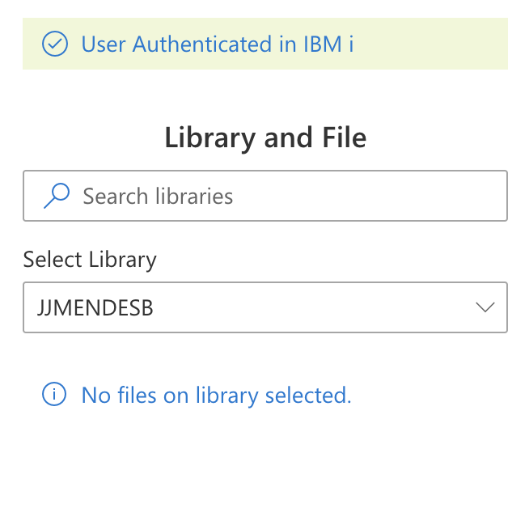

# PropertyFieldMessage control

This control generates a Message Bar that will show messages  .

**PropertyFieldMessage example usage**



## How to use this control in your solutions

- Check that you installed the `@pnp/spfx-property-controls` dependency. Check out The [getting started](../../#getting-started) page for more information about installing the dependency.
- Import the following modules to your component:

```TypeScript
import { PropertyFieldMessage} from '@pnp/spfx-property-controls/lib/PropertyFieldMessage';
```

- Add the custom property control to the `groupFields` of the web part property pane configuration:

```TypeScript
 PropertyFieldMessage("", {
      key: "MessageKey",
      text: "Something went wrong... try later.",
      messageType:  MessageBarType.error
      isVisible:  true ,
  }),
```


## Implementation

The `PropertyFieldMessage` control can be configured with the following properties:


| Property | Type | Required | Description |
| ---- | ---- | ---- | ---- |
| key | string | yes | An unique key that indicates the identity of this control. |
| text | string | yes | Message Text |
| messageType | MessageBarType | yes | type of message  |
| multiline | boolean | no | Indicate if message is multiline |
| classname | string | no | css ClassName|
| isVisible | boolean | yes | Indicate if message is visible |


