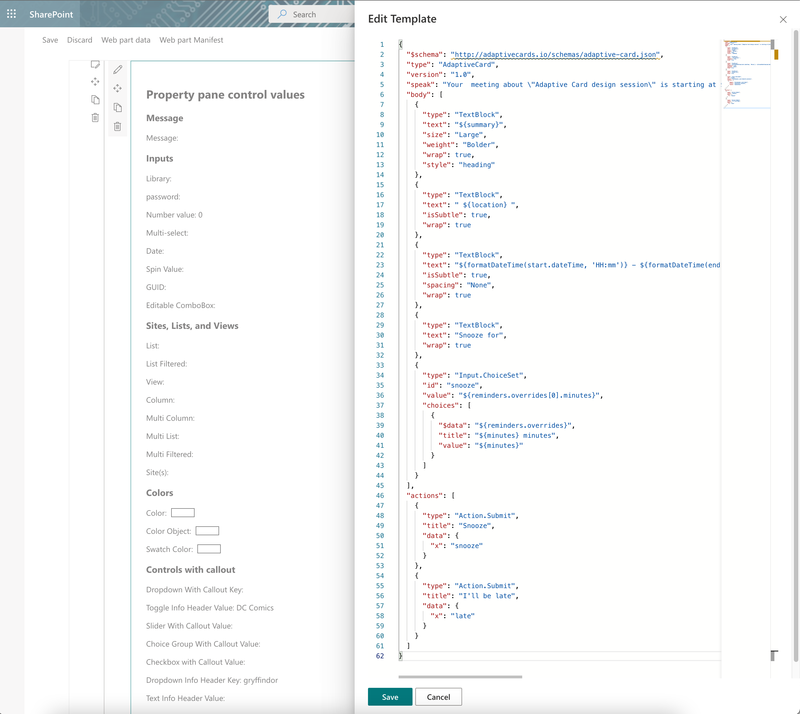

# PropertyFieldMonacoEditor control

This control implement Microsoft Monaco Editor. 

**PropertyFieldMonacoEditor example usage**





## How to use this control in your solutions

- Check that you installed the `@pnp/spfx-property-controls` dependency. Check out The [getting started](../../#getting-started) page for more information about installing the dependency.
- Import the following modules to your component:

```TypeScript
import { PropertyFieldMonacoEditor } from '@pnp/spfx-property-controls/lib/PropertyFieldMonacoEditor';
```

- Create a new property for your web part, for example:

```TypeScript
export interface IPropertyControlsTestWebPartProps {
  monacoEditorValue: string;
}
```

- Add the custom property control to the `groupFields` of the web part property pane configuration:

```TypeScript
PropertyFieldMonacoEditor('monacoEditor', {
      key: 'monacoEditor',
      value: this.properties.monacoEditorValue,
      showMiniMap: true,
      onValueChange: this.monacoChange ,
      language:"json",
      showLineNumbers:true,
    }),
```


## Implementation

The `PropertyFieldMonacoEditor` control can be configured with the following properties:

| Property | Type | Required | Description |
| ---- | ---- | ---- | ---- |
| key | string | yes | An unique key that indicates the identity of this control. |
| value | number | yes | Value field. |
| theme | string | no | 'vs-dark' | 'vs-light' | 'hc-black';|
| readOnly | boolean | no | editor is read only  |
| showLineNumbers | boolean | no | Show line number - default no |
| showMiniMap | boolean| no | Show Mini Map -  deafault yes|
| onValueChange | (newValue:string, validationErrors?:string[]) => void; | no | If set, this method is used to get the the input value when it changed|
| language | string |yes | language, please see https://microsoft.github.io/monaco-editor/index.html for all supported languages|
| jsonDiagnosticsOptions | monaco.languages.json.DiagnosticsOptions | no | see https://microsoft.github.io/monaco-editor/api/interfaces/monaco.languages.json.DiagnosticsOptions.html |
| jscriptDiagnosticsOptions | monaco.languages.typescript.DiagnosticsOptions | no | see https://microsoft.github.io/monaco-editor/api/interfaces/monaco.languages.typescript.DiagnosticsOptions.html |
| panelWidth | number | no | Panel Width default 800px. |


