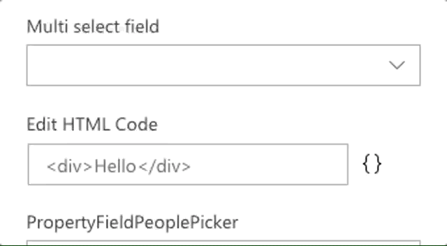

# PropertyFieldMultiSelect control

This control generates a dropdown with the possibility of selecting multiple values.

**Multi-select field rendering**



## How to use this control in your solutions

1. Check that you installed the `@pnp/spfx-property-controls` dependency. Check out The [getting started](../#getting-started) page for more information about installing the dependency.
2. Import the following modules to your component:

```TypeScript
import { PropertyFieldMultiSelect } from '@pnp/spfx-property-controls/lib/PropertyFieldMultiSelect';
```

3. Create a new property for your web part, for example:

```TypeScript
export interface IPropertyControlsTestWebPartProps {
  multiSelect: string[];
}
```

4. Add the custom property control to the `groupFields` of the web part property pane configuration:

```TypeScript
PropertyFieldMultiSelect('multiSelect', {
  key: 'multiSelect',
  label: "Multi select field",
  options: [
    {
      key: "EN",
      text: "EN"
    },
    {
      key: "FR",
      text: "FR"
    },
    {
      key: "NL",
      text: "NL"
    }
  ],
  selectedKeys: this.properties.multiSelect
})
```

## Implementation

The `PropertyFieldMultiSelect` control uses the same implementation as the default `PropertyPaneDropdown` control and has the following additional properties:

| Property | Type | Required | Description |
| ---- | ---- | ---- | ---- |
| selectedKeys | string[] OR number[] | no | Specifies the selected keys. |

> **Important**: Do not make use of the `selectedKey` property. This property is inherited from the `PropertyPaneDropdown` control.


