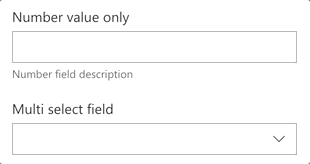

# PropertyFieldNumber control

This control generates an input field for numbers. Text is not allowed as this will result into an invalid input.

**PropertyFieldNumber example usage**



## How to use this control in your solutions

- Check that you installed the `@pnp/spfx-property-controls` dependency. Check out The [getting started](../#getting-started) page for more information about installing the dependency.
- Import the following modules to your component:

```TypeScript
import { PropertyFieldNumber } from '@pnp/spfx-property-controls/lib/PropertyFieldNumber';
```

- Create a new property for your web part, for example:

```TypeScript
export interface IPropertyControlsTestWebPartProps {
  numberValue: number;
}
```

- Add the custom property control to the `groupFields` of the web part property pane configuration:

```TypeScript
PropertyFieldNumber("numberValue", {
  key: "numberValue",
  label: "Number value only",
  description: "Number field description",
  value: this.properties.numberValue,
  maxValue: 10,
  minValue: 1,
  disabled: false
})
```

- You can also implement your own validation with the `onGetErrorMessage` property as follows:

```TypeScript
PropertyFieldNumber("numberValue", {
  key: "numberValue",
  label: "Number value only",
  description: "Number field description",
  value: this.properties.numberValue,
  maxValue: 10,
  minValue: 1,
  disabled: false,
  onGetErrorMessage: (value: number) => {
    if (value % 2 !== 0) {
      return 'Only even numbers are allowed';
    }
    return '';
  }
})
```

## Implementation

The `PropertyFieldNumber` control can be configured with the following properties:

| Property | Type | Required | Description |
| ---- | ---- | ---- | ---- |
| key | string | yes | An unique key that indicates the identity of this control. |
| label | string | yes | Property field label displayed on top. |
| description | string | no | The number field input description. |
| placeholder | string | no | Placeholder text to be displayed in the number field. |
| value | number | no | Value to be displayed in the number field. |
| maxValue | number | no | Maximum number that can be inserted. |
| minValue | number | no | Minimum number that can be inserted. |
| disabled | boolean | no | Specify if the control needs to be disabled. |
| errorMessage | string | no | If set, this will be displayed as an error message. |
| onGetErrorMessage | (value: number) => string | no | If set, this method is used to get the validation error message and determine whether the input value is valid or not. |
| deferredValidationTime | number | no | Number field will start to validate after users stop typing for `deferredValidationTime` milliseconds. |


