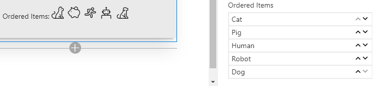

# PropertyFieldOrder control

This control generates a list that can be easily reordered using drag and drop and/or arrow buttons.

**PropertyFieldOrder**



## How to use this control in your solutions

1. Check that you installed the `@pnp/spfx-property-controls` dependency. Check out The [getting started](../#getting-started) page for more information about installing the dependency.
2. Import the following modules to your component:

```TypeScript
import { PropertyFieldOrder } from '@pnp/spfx-property-controls/lib/PropertyFieldOrder';
```

3. Create a new property for your web part, for example:

```TypeScript
export interface IPropertyControlsTestWebPartProps {
  orderedItems: Array<any>;
}
```

4. Add the custom property control to the `groupFields` of the web part property pane configuration:

```TypeScript
PropertyFieldOrder("orderedItems", {
  key: "orderedItems",
  label: "Ordered Items",
  items: this.properties.orderedItems,
  properties: this.properties,
  onPropertyChange: this.onPropertyPaneFieldChanged
})
```

## Item Rendering

By default, items will render using the `toString()` method for each element in your `items` array. This works well for simple arrays of strings, numbers, etc.

### Object Property

When working with an array of objects, you can specify the name of the property to use as the display value by specifying the `textProperty` property.

For instance, for an array of objects like the following:
```
[
  {"text": "Cat", "iconName": "Cat"},
  {"text": "Pig", "iconName": "Savings"},
  {"text": "Human", "iconName": "Running"},
  {"text": "Robot", "iconName": "Robot"},
  {"text": "Dog", "iconName": "FangBody"}
]
```
To prevent every item from showing as `[object Object]`, you can set the `textProperty` property to the name of the property you would like to use for display:
```TypeScript
PropertyFieldOrder("orderedItems", {
  key: "orderedItems",
  label: "Ordered Items",
  items: this.properties.orderedItems,
  textProperty: "text",
  properties: this.properties,
  onPropertyChange: this.onPropertyPaneFieldChanged
})
```


### Custom Rendering

You can fully customize how items are rendered by providing the `onRenderItem` callback function and returning whatever `JSX.Element` you want.

For example, you can define your function in a _tsx_ file like this:
```TypeScript
import * as React from 'react';

export const orderedItem = (item:any, index:number): JSX.Element => {
	return (
		<span>
			<i className={"ms-Icon ms-Icon--" + item.iconName} style={{paddingRight:'4px'}}/>
			{item.text}
		</span>
	);
};
```

You can then import this function into your webpart using the relative path to this file similar to the following:
```TypeScript
import { orderedItem } from './components/OrderedItem';
```

Then you can simply reference it in your `PropertyFieldOrder`:
```TypeScript
PropertyFieldOrder("orderedItems", {
  key: "orderedItems",
  label: "Ordered Items",
  items: this.properties.orderedItems,
  onRenderItem: orderedItem,
  properties: this.properties,
  onPropertyChange: this.onPropertyPaneFieldChanged
})
```


## Implementation

The `PropertyFieldOrder` control can be configured with the following properties:

| Property | Type | Required | Description |
| ---- | ---- | ---- | ---- |
| label | string | yes | Property field label displayed on top. |
| items | Array<any> | yes | An array of values to reorder. |
| textProperty | string | no | The property to use for display, when undefined, the toString() method of the object is used (ignored when the onRenderItem function is specified) |
| maxHeight | number | no | The maximun height for the items in px (when not set, the control expands as necessary) |
| disabled | boolean | no | Specify if the control needs to be disabled. |
| disableDragAndDrop | boolean | no | When true, drag and drop reordering is disabled (defaults to false) |
| removeArrows | boolean | no | When true, arrow buttons are not displayed (defaults to false) |
| moveUpIconName | string | no | The name of the UI Fabric Font Icon to use for the move up button (defaults to ChevronUpSmall) |
| moveDownIconName | string | no | The name of the UI Fabric Font Icon to use for the move down button (defaults to ChevronDownSmall) |
| onRenderItem | function | no | Optional callback to provide custom rendering of the item (default is simple text based on either item or the property identified in the textProperty) |
| properties | any | yes | Parent web part properties, this object is use to update the property value.  |
| onPropertyChange | function | yes | Defines a onPropertyChange function to raise when the date gets changed. |
| key | string | yes | An unique key that indicates the identity of this control. |

