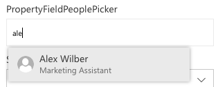
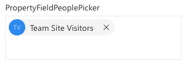

# PropertyFieldPeoplePicker control

This control generates a people / group picker that can be used in the property pane of your SharePoint Framework web parts.

**Searching for persons**



**Searching for groups**


**Selected people / groups**



## How to use this control in your solutions

1. Check that you installed the `@pnp/spfx-property-controls` dependency. Check out the [getting started](../getting-started) page for more information about installing the dependency.
2. Import the following modules to your component:

```TypeScript
import { PropertyFieldPeoplePicker, PrincipalType } from '@pnp/spfx-property-controls/lib/PropertyFieldPeoplePicker';
```

3. Create a new property for your web part, for example:

```TypeScript
import { IPropertyFieldGroupOrPerson } from "@pnp/spfx-property-controls/lib/PropertyFieldPeoplePicker";

export interface IPropertyControlsTestWebPartProps {
  people: IPropertyFieldGroupOrPerson[];
}
```

4. Add the custom property control to the `groupFields` of the web part property pane configuration:

```TypeScript
PropertyFieldPeoplePicker('people', {
  label: 'PropertyFieldPeoplePicker',
  initialData: this.properties.people,
  allowDuplicate: false,
  principalType: [PrincipalType.Users, PrincipalType.SharePoint, PrincipalType.Security],
  onPropertyChange: this.onPropertyPaneFieldChanged,
  context: this.context,
  properties: this.properties,
  onGetErrorMessage: null,
  deferredValidationTime: 0,
  key: 'peopleFieldId'
})
```

## Implementation

The `PropertyFieldPeoplePicker` control can be configured with the following properties:

| Property | Type | Required | Description |
| ---- | ---- | ---- | ---- |
| label | string | yes | Property field label displayed on top. |
| disabled | boolean | no | Specify if the control needs to be disabled. |
| context | WebPartContext | yes | Context of the current web part. |
| initialData | IPropertyFieldGroupOrPerson[] | no | Intial data to load in the people picker (optional). |
| allowDuplicate | boolean | no | Defines if the People Picker allows to select duplicated users (optional). |
| principalType | PrincipalType[] | no | Define which type of data you want to retrieve: User, SharePoint groups, Security groups. Multiple are possible. |
| onPropertyChange | function | yes | Defines a onPropertyChange function to raise when the date gets changed. |
| properties | any | yes | Parent web part properties, this object is use to update the property value.  |
| key | string | yes | An unique key that indicates the identity of this control. |
| onGetErrorMessage | function | no | The method is used to get the validation error message and determine whether the input value is valid or not. See [this documentation](https://dev.office.com/sharepoint/docs/spfx/web-parts/guidance/validate-web-part-property-values) to learn how to use it. |
| deferredValidationTime | number | no | Control will start to validate after users stop typing for `deferredValidationTime` milliseconds. Default value is 200. |

Interface `IPropertyFieldGroupOrPerson`

| Property | Type | Required | Description |
| ---- | ---- | ---- | ---- |
| id | string | no | The ID of the group |
| description | string | no | Group description |
| fullName | string | yes | Users' full name or group display name |
| login | string | yes | Users' login or group provider name (when security group) or group account name (when SharePoint group). |
| email | string | no | Users' email |
| jobTitle | string | no | Users' job title |
| initials | string | no | Users' initials |
| imageUrl | string | no | Users' profile image URL |

Enum `PrincipalType`

The `PrincipalType` enum can be used to specify the types of information you want to query: User, Security groups, and/or SharePoint groups.

| Name | Description |
| ---- | ---- |
| Users | To specify if you want to retrieve users. |
| Security | To specify if you want to retrieve security groups. |
| SharePoint | To specify if you want to retrieve SharePoint groups. |

