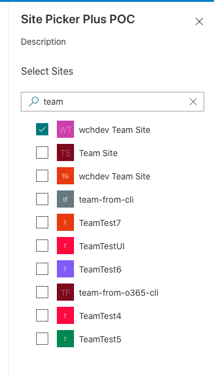
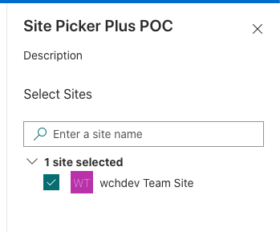

# PropertyFieldSitePickerPlus control

This control generates a site picker that can be used in the property pane of your SharePoint Framework web parts.

It's similar to the other "Site Picker" control, but it will include site logos. It was also developed before that control was added, but functions largely the same.

**Searching for sites**



**Selected sites**



## How to use this control in your solutions

1. Check that you installed the `@pnp/spfx-property-controls` dependency. Check out The [getting started](../../#getting-started) page for more information about installing the dependency.
2. Import the following modules to your component:

```TypeScript
import { PropertyFieldSitePickerPlus } from '@pnp/spfx-property-controls/lib/PropertyFieldSitePickerPlus';
```

3. Create a new property for your web part, for example:

```TypeScript
import { IPropertyFieldSitePlus } from "@pnp/spfx-property-controls/lib/PropertyFieldSitePickerPlus";

export interface IPropertyControlsTestWebPartProps {
  sites: IPropertyFieldSitePlus[];
}
```

4. Add the custom property control to the `groupFields` of the web part property pane configuration:

```TypeScript
PropertyFieldSitePickerPlus("sites", {
  label: "Pick a site",
  context: this.context,
  onPropertyChange: this._updateSelectedSites.bind(this),
  properties: this.properties
})
```

## Implementation

The `PropertyFieldSitePickerPlus` control can be configured with the following properties:

| Property | Type | Required | Description |
| ---- | ---- | ---- | ---- |
| label | string | yes | Property field label displayed on top. |
| disabled | boolean | no | Specify if the control needs to be disabled. |
| context | WebPartContext | yes | Context of the current web part. |
| initialData | IPropertyFieldGroupOrPerson[] | no | Intial sites to load in the site picker (optional). |
| onPropertyChange | function | yes | Defines a onPropertyChange function to raise when the sites get changed. |
| properties | any | yes | Parent web part properties, this object is use to update the property value. |
| key | string | yes | An unique key that indicates the identity of this control. |
| onGetErrorMessage | function | no | The method is used to get the validation error message and determine whether the input value is valid or not. See [this documentation](https://dev.office.com/sharepoint/docs/spfx/web-parts/guidance/validate-web-part-property-values) to learn how to use it. |
| deferredValidationTime | number | no | Control will start to validate after users stop typing for `deferredValidationTime` milliseconds. Default value is 200. |

Interface `IPropertyFieldSitePlus`

| Property | Type | Required | Description |
| ---- | ---- | ---- | ---- |
| title | string | Yes | Site's display name |
| url | string | Yes | URL to the site |
| IconUrl| string | no | URL to the sites logo |
| Selected | bool | no | Is the site selected | 


