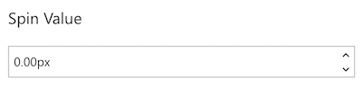

# PropertyFieldSpinButton control

This control generates a spin button which allows the user to incrementally adjust a value in small steps.

**PropertyFieldSpinButton initial render**



**PropertyFieldSpinButton increment**


## How to use this control in your solutions

1. Check that you installed the `@pnp/spfx-property-controls` dependency. Check out The [getting started](../../#getting-started) page for more information about installing the dependency.
2. Import the following modules to your component:

```TypeScript
import { PropertyFieldSpinButton } from '@pnp/spfx-property-controls/lib/PropertyFieldSpinButton';
```

3. Create a new property for your web part, for example:

```TypeScript
export interface IPropertyControlsTestWebPartProps {
  spinValue: number;
}
```

4. Add the custom property control to the `groupFields` of the web part property pane configuration:

```TypeScript
PropertyFieldSpinButton('spinValue', {
  label: 'Spin Value',
  initialValue: this.properties.spinValue,
  onPropertyChange: this.onPropertyPaneFieldChanged,
  properties: this.properties,
  disabled: false,
  suffix: 'px',
  min: 0,
  max: 5,
  step: 0.25,
  decimalPlaces: 2,
  incrementIconName: 'CalculatorAddition',
  decrementIconName: 'CalculatorSubtract',
  key: 'spinButtonFieldId'
})
```

## Implementation

The `PropertyFieldSpinButton` control can be configured with the following properties:

| Property | Type | Required | Description |
| ---- | ---- | ---- | ---- |
| label | string | yes | Property field label displayed on top. |
| disabled | boolean | no | Specify if the control needs to be disabled. |
| initialValue | number | no | Initial number value of the control. |
| step | number | no | The difference between the two adjacent values of the SpinButton (default is 1) |
| min | number | no | The minimum value (no minimum when unspecified) |
| max | number | no | The minimum value (no minimum when unspecified) |
| incrementIconName | string | no | The name of the UI Fabric Font Icon to use for the increment button (defaults to ChevronUpSmall) |
| decrementIconName | string | no | The name of the UI Fabric Font Icon to use for the decrement button (defaults to ChevronDownSmall) |
| suffix | string | no | An optional string value to append to the field display |
| decimalPlaces | number | no | The number of decimal places to show/allow (defaults to 0) |
| properties | any | yes | Parent web part properties, this object is use to update the property value.  |
| onPropertyChange | function | yes | Defines a onPropertyChange function to raise when the date gets changed. |
| key | string | yes | An unique key that indicates the identity of this control. |


