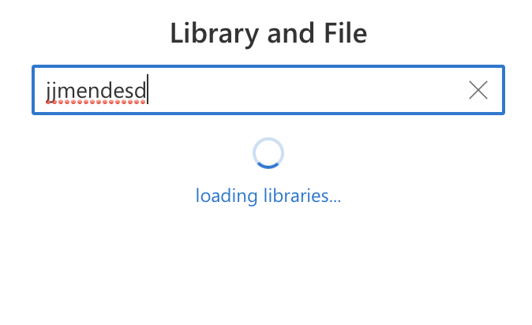

# PropertyFieldSpinner control

This control generates a Message Bar that will show messages  .

**PropertyFieldSpinner example usage**



## How to use this control in your solutions

- Check that you installed the `@pnp/spfx-property-controls` dependency. Check out The [getting started](../../#getting-started) page for more information about installing the dependency.
- Import the following modules to your component:

```TypeScript
import { PropertyFieldSpinner} from '@pnp/spfx-property-controls/lib/PropertyFieldSpinner';
```

- Add the custom property control to the `groupFields` of the web part property pane configuration:

```TypeScript
 PropertyFieldSpinner("", {
      key: "sp1",
      size: SpinnerSize.medium,
      isVisible: true,
      label: "Loading ..."
  })
```


## Implementation

The `PropertyFieldSpinner` control can be configured with the following properties:


| Property | Type | Required | Description |
| ---- | ---- | ---- | ---- |
| key | string | yes | An unique key that indicates the identity of this control. |
| size | SpinnerSize | yes | Size of Spinner  |
| classname | string | no | css ClassName|
| isVisible | boolean | yes | Indicate if message is visible |
| Label | string | no | Label to Show | 


