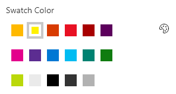

# PropertyFieldSwatchColorPicker control

This control generates a swatch color picker that you can use inside the property pane.

**PropertyFieldSwatchColorPicker**


**PropertyFieldColorPicker color selector**



## How to use this control in your solutions

1. Check that you installed the `@pnp/spfx-property-controls` dependency. Check out The [getting started](../../#getting-started) page for more information about installing the dependency.
2. Import the following modules to your component:

```TypeScript
import { PropertyFieldSwatchColorPicker, PropertyFieldSwatchColorPickerStyle } from '@pnp/spfx-property-controls/lib/PropertyFieldSwatchColorPicker';
```

3. Create a new property for your web part, for example:

```TypeScript
export interface IPropertyControlsTestWebPartProps {
  color: string;
}
```

4. Add the custom property control to the `groupFields` of the web part property pane configuration:

```TypeScript
PropertyFieldSwatchColorPicker('color', {
  label: 'Swatch Color',
  selectedColor: this.properties.color,
  colors: [
    { color: '#ffb900', label: 'Yellow' },
    { color: '#fff100', label: 'Light Yellow' },
    { color: '#d83b01', label: 'Orange'},
    { color: '#e81123', label: 'Red' },
    { color: '#a80000', label: 'Dark Red'},
    { color: '#5c005c', label: 'Dark Magenta' },
    { color: '#e3008c', label: 'Light Magenta'},
    { color: '#5c2d91', label: 'Purple'},
    { color: '#0078d4', label: 'Blue'},
    { color: '#00bcf2', label: 'Light Blue' },
    { color: '#008272', label: 'Teal'},
    { color: '#107c10', label: 'Green'},
    { color: '#bad80a', label: 'Light Green' },
    { color: '#eaeaea'},
    { color: 'black', label: 'Black'},
    { color: '#333333', label: 'Neutral'},
    { color: 'rgba(102, 102, 102, 0.5)', label: 'Half Gray' }
  ],
  onPropertyChange: this.onPropertyPaneFieldChanged,
  properties: this.properties,
  key: 'colorFieldId'
})
```

## Implementation

The `PropertyFieldColorPicker` control can be configured with the following properties:

| Property | Type | Required | Description |
| ---- | ---- | ---- | ---- |
| label | string | yes | Property field label displayed on top. |
| disabled | boolean | no | Specify if the control needs to be disabled. |
| selectedColor | string or IColor | no | The CSS-compatible string or an IColor object to describe the initial color |
| color | IPropertyFieldSwatchColorOption[] | yes | The color choices (color can be any CSS-Compatible string, labels are optional and will be shown as a tooltip on the swatch) |
| showAsCircles | boolean | no | When true, color cells are shown as circles. When false (default), color cells are shown as squares |
| columnCount | number | no | The number of cells to show per row (defaults to 6, minimum of 1 and maximum of 8) |
| style | PropertyFieldSwatchColorPickerStyle | no | Determines how the control is displayed (defaults to inline) |
| iconName | string | no | The name of the UI Fabric Font Icon to use for Inline display (defaults to Color) |
| valueAsObject | boolean | no | When true, the property is returned as an IColor object. When false (default), the property is returned as a CSS-compatible string |
| properties | any | yes | Parent web part properties, this object is use to update the property value.  |
| onPropertyChange | function | yes | Defines a onPropertyChange function to raise when the date gets changed. |
| key | string | yes | An unique key that indicates the identity of this control. |

Enum `PropertyFieldSwatchColorPickerStyle`

| Name | Description |
| ---- | ---- |
| Full | Display the full control in the property pane |
| Inline | Display the color picker inline |

## Value

By default, the Swatch Color Picker returns the value as a CSS-compatible string. This allows you the flexibility of simply assigning the value to an inline style as is and this is usually sufficient. However, this also limits the information directly available to you since the format could be a Hex code, an RGBA value, or even a named color and may not be suitable for advanced scenarios.

By setting the `valueAsObject` property to true, you will always receive a consistent IColor object that provides you detailed information about the chosen color. Here are the properties available in the IColor object:

| Property | Type | Description |
| ---- | ---- | ---- |
| str | string | CSS-compatible string (this is the same value that would normally be returned when `valueAsObject` is false) |
| hex | string | Hex value (does not reflect alpha) |
| r |  number | Red |
| g | number | Green |
| b | number | Blue |
| h | number | Hue |
| s | number | Saturation |
| v | number | Value |


