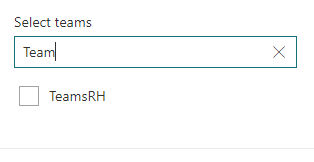
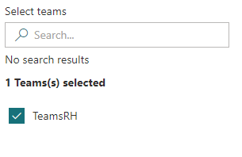

# PropertyFieldSitePicker control

This control generates a MS Team picker, select O365 group with a team associated that can be used in the property pane of your SharePoint Framework web parts.

**Searching for sites**
 


**Selected teams**




## How to use this control in your solutions

1. Check that you installed the `@pnp/spfx-property-controls` dependency. Check out The [getting started](../../#getting-started) page for more information about installing the dependency.
2. Import the following modules to your component:

```TypeScript
import { PropertyFieldTeamPicker } from '@pnp/spfx-property-controls/lib/PropertyFieldTeamPicker';
```

3. Create a new property for your web part, for example:

```TypeScript
import { IPropertyFieldTeam } from "@pnp/spfx-property-controls/lib/PropertyFieldTeamPicker";

export interface IPropertyControlsTestWebPartProps {
  teams: IPropertyFieldTeam[];
}
```

4. Add the custom property control to the `groupFields` of the web part property pane configuration:

```TypeScript
PropertyFieldTeamPicker('teams', {
  label: 'Select teams',
  initialSites: this.properties.teams,
  context: this.context,
  deferredValidationTime: 500,
  multiSelect: true,
  onPropertyChange: this.onPropertyPaneFieldChanged,
  properties: this.properties,
  key: 'teamsFieldId'
})
```

## Implementation

The `PropertyFieldTeamPicker` control can be configured with the following properties:

| Property | Type | Required | Description |
| ---- | ---- | ---- | ---- |
| label | string | yes | Property field label displayed on top. |
| disabled | boolean | no | Specify if the control needs to be disabled. |
| context | WebPartContext | yes | Context of the current web part. |
| initialSites | IPropertyFieldGroupOrPerson[] | no | Intial sites to load in the site picker (optional). |
| multiSelect | boolean | no | Define if you want to allow multi sites selection. (optional, false by default). |
| onPropertyChange | function | yes | Defines a onPropertyChange function to raise when the sites get changed. |
| properties | any | yes | Parent web part properties, this object is use to update the property value. |
| key | string | yes | An unique key that indicates the identity of this control. |
| onGetErrorMessage | function | no | The method is used to get the validation error message and determine whether the input value is valid or not. See [this documentation](https://dev.office.com/sharepoint/docs/spfx/web-parts/guidance/validate-web-part-property-values) to learn how to use it. |
| deferredValidationTime | number | no | Control will start to validate after users stop typing for `deferredValidationTime` milliseconds. Default value is 200. |

Interface `IPropertyFieldTeam`

| Property | Type | Required | Description |
| ---- | ---- | ---- | ---- |
| id | string | no | The ID of the O365 Group |
| title | string | no | Teams's display name |
| url | string | no | URL to the O365 Group  |


