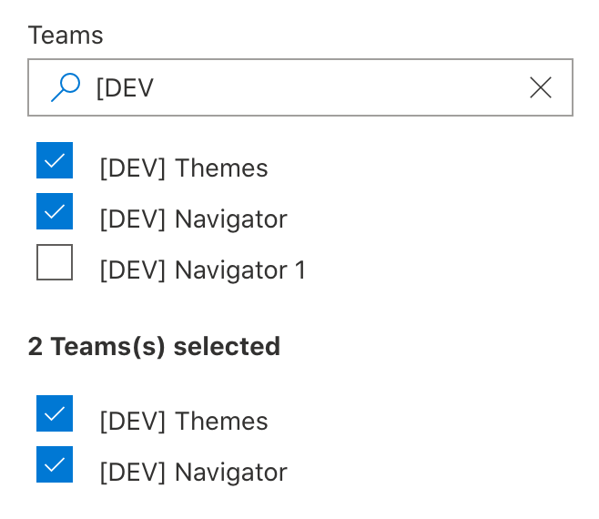

# PropertyFieldTeamPicker control
This control generates a team picker that can be used in the property pane of your SharePoint Framework web parts.

**Searching for teams**


**Selected teams**



## How to use this control in your solutions

1. Check that you installed the `@pnp/spfx-property-controls` dependency. Check out The [getting started](../../#getting-started) page for more information about installing the dependency.
2. Request Microsoft Graph permissions in `config/package-solution.json`:
```json
{
  "solution": {
    "webApiPermissionRequests": [
      {
      "resource": "Microsoft Graph",
      "scope": "Team.ReadBasic.All"
    }, {
      "resource": "Microsoft Graph",
      "scope": "Files.Read"
    }]
  }
}
```
!!! Note
    `Team.ReadBasic.All` and `Files.Read` is a minimum set of permissions needed for the component. For other options please see [List Joined Teams](https://docs.microsoft.com/en-us/graph/api/user-list-joinedteams?view=graph-rest-1.0&tabs=http) and [Get Drive](https://docs.microsoft.com/en-us/graph/api/drive-get?view=graph-rest-1.0&tabs=http) documentation.

3. Import the following modules to your component:

```TypeScript
import { PropertyFieldSitePicker } from '@pnp/spfx-property-controls/lib/PropertyFieldSitePicker';
```

4. Create a new property for your web part, for example:

```TypeScript
import { IPropertyFieldTeam } from '../../PropertyFieldTeamPicker';

export interface IPropertyControlsTestWebPartProps {
  teams: IPropertyFieldTeam[];
}
```

5. Add the custom property control to the `groupFields` of the web part property pane configuration:

```TypeScript
PropertyFieldTeamPicker('teams', {
  key: 'teamsPicker',
  context: this.context,
  label: 'Select teams',
  onPropertyChange: this.onPropertyPaneFieldChanged,
  properties: this.properties,
  initialTeams: this.properties.teams,
  multiSelect: true
})
```

## Implementation

The `PropertyFieldTeamPicker` control can be configured with the following properties:

| Property | Type | Required | Description |
| ---- | ---- | ---- | ---- |
| label | string | yes | Property field label displayed on top. |
| disabled | boolean | no | Specify if the control needs to be disabled. |
| context | BaseComponentContext | yes | Context of the current web part. |
| initialTeams | IPropertyFieldTeam[] | no | Initial teams to load in the site picker (optional). |
| multiSelect | boolean | no | Define if you want to allow multiple teams selection. (optional, false by default). |
| onPropertyChange | function | yes | Defines a `onPropertyChange` function to raise when the teams get changed. |
| properties | any | yes | Parent web part properties, this object is used to update the property value. |
| key | string | yes | An unique key that indicates the identity of this control. |
| onGetErrorMessage | function | no | The method is used to get the validation error message and determine whether the input value is valid or not. See [this documentation](https://dev.office.com/sharepoint/docs/spfx/web-parts/guidance/validate-web-part-property-values) to learn how to use it. |
| deferredValidationTime | number | no | Control will start to validate after users stop typing for `deferredValidationTime` milliseconds. Default value is 200. |

Interface `IPropertyFieldTeam`

| Property | Type | Required | Description |
| ---- | ---- | ---- | ---- |
| id | string | no | The ID of the team (group) |
| title | string | no | Teams's display name |
| url | string | no | URL to the underlying site |


