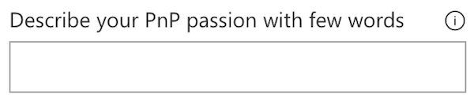
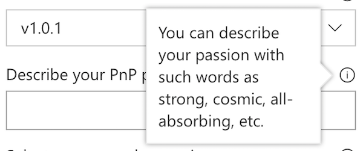

# PropertyFieldTextWithCallout control

This control generates a text field control with a callout.

**PropertyFieldTextWithCallout rendering**




**PropertyFieldTextWithCallout callout opened**



## How to use this control in your solutions

1. Check that you installed the `@pnp/spfx-property-controls` dependency. Check out The [getting started](../../#getting-started) page for more information about installing the dependency.
2. Import the following modules to your component:

```TypeScript
import { CalloutTriggers } from '@pnp/spfx-property-controls/lib/PropertyFieldHeader';
import { PropertyFieldTextWithCallout } from '@pnp/spfx-property-controls/lib/PropertyFieldTextWithCallout';
```

3. Create a new property for your web part, for example:

```TypeScript
export interface IPropertyControlsTestWebPartProps {
  textInfoHeaderValue: string;
}
```

4. Add the custom property control to the `groupFields` of the web part property pane configuration:

```TypeScript
PropertyFieldTextWithCallout('textInfoHeaderValue', {
  calloutTrigger: CalloutTriggers.Hover,
  key: 'textInfoHeaderFieldId',
  label: 'Describe your PnP passion with few words',
  calloutContent: React.createElement('span', {}, 'You can describe your passion with such words as strong, cosmic, all-absorbing, etc.'),
  calloutWidth: 150,
  value: this.properties.textInfoHeaderValue
})
```

## Implementation

The `PropertyFieldTextWithCallout` control uses the same implementation as the default `PropertyPaneTextField` and has the following additional properties:

| Property | Type | Required | Description |
| ---- | ---- | ---- | ---- |
| calloutContent | React.ReactNode | no | Callout content - any HTML |
| calloutWidth | number | no | Custom width for callout including borders. If value is 0, no width is applied. |
| calloutTrigger | CalloutTriggers | no | Event to show the callout |
| gapSpace | number | no | The gap between the callout and the target |

Enum `CalloutTriggers`

| Name | Description |
| ---- | ---- |
| Click | Shows the callout when you hover over the icon |
| Hover | Shows the callout when you click on the icon |


