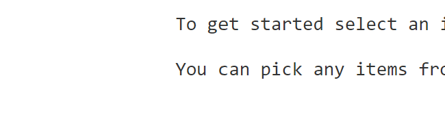
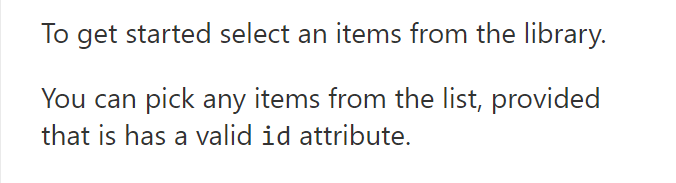

# PropertyPaneMarkdownContent control

This control allows you to embed content in a property pane using [Markdown](https://daringfireball.net/projects/markdown/) content.

You can use this control to easily provide guidance for your users and create other content that is not easily created otherwise.

It supports any arbitrary HTML without using `dangerouslySetInnerHTML`, and allows overriding any HTML tag.

**PropertyPaneMarkdownContent rendering**


## How to use this control in your solutions

1. Check that you installed the `@pnp/spfx-property-controls` dependency. Check out The [getting started](../../#getting-started) page for more information about installing the dependency.
2. Import the following modules to your component: 

```TypeScript
import { PropertyPaneMarkdownContent } from '@pnp/spfx-property-controls/lib/PropertyPaneMarkdownContent';
```

3. Create a string with Markdown content for your property pane, for example:

```TypeScript
const md: string = `
### This is Markdown

[Markdown](http://daringfireball.net/projects/markdown/) lets you write content in a really natural way.

  * You can have lists, like this one
  * Make things **bold** or *italic*
  * Embed snippets of \`code\`
  * Create [links](/)
  * ...

Also supports GitHub-flavored Markdown checklists

- [x] Checklist item 1
- [x] Checklist item 2
- [ ] Checklist item 3

<small>Sample content borrowed with thanks from [markdown-to-jsx](https://probablyup.com/markdown-to-jsx/) ❤️</small>`
```

4. Add the custom property control to the `groupFields` of the web part property pane configuration:

```TypeScript
PropertyPaneMarkdownContent({
  markdown: md,
  key: 'markdownSample'
})
```

### Indentation

Pay close attention to the indentation in your Markdown string. The Markdown parser assumes that four spaces preceding your content means a code block. This means that the following Markdown will render most of the content a code block:

```TypeScript
const md: string = `
    To get started select an items from the library.
    
    You can pick any items from the list, provided that is has a valid \`id\` attribute.`
```

Producing the following HTML:



To solve this issue, make sure that your content is not indented.

```TypeScript
const md: string = `To get started select an items from the library.
    
You can pick any items from the list, provided that is has a valid \`id\` attribute.`
```

Which will produce the following HTML:


### Overriding rendering of HTML elements

You can override the rendering of any HTML element by specifying an `overrides` prop to the `options`.

For example, to override the CSS class of `H3` elements (which is defined by a `###` in Markdown), you can override the `className` attribute using the following code:

```typescript
PropertyPaneMarkdownContent({
  markdown: `
### This is a heading 3

You can override any HTML you want`,
  key: 'markdownSample',
  options: {
    overrides: {
      h3: { // Markdown equivalent of ###
        props: {
          className: "ms-font-xl ms-fontColor-neutralDark",
        },
      },
    }
  }}),
```

You can also render your own React elements using the `overrides` prop. For example, if you have a `MyCustomControl` React element, you can use the following:

```typescript
// Import your React element
import MyCustomControl from 'MyCustomControl';

...

PropertyPaneMarkdownContent({
  markdown: `
### This is a heading 3

You can override any HTML you want

<MyCustomControl sampleMessage='This is a sample message'/>
`,
  key: 'markdownSample',
  options: {
    overrides: {
      h3: { // Markdown equivalent of ###
        props: {
          className: "ms-font-xl ms-fontColor-neutralDark",
        },
      },
      // Override the React element
      MyCustomControl: MyCustomControl
    }
  }}),
```

### Rendering all elements as inline or block elements

By default, the control will attempt to determine whether the Markdown content should be wrapped in a `<div>`, `<p>`, or `<span>` to render content as block or inline elements.

For example, the following Markdown will be rendered as inline content:

```markdown
This is an _inline_ element
```

And the following Markdown will be rendered as block content:

```markdown
## This is a block element
```

However, you can override rendering all HTML as block elements or inline elements by passing `forceBlock: true` or `forceInline: true` to the component's `options` prop.

### Named unicode

By default the control converts named html codes to their unicode character equivalents:

* **&:** `&amp;`
* **':** `&apos;`
* **>:** `&gt;`
* **<:** `&lt;`
* **(space)**: `&nbsp;`
* **":** `&quot;`

If you need to extend this map of named codes and unicode characters, you can pass a list of additional html codes by using the  `namedCodesToUnicode` option as object with the code names needed as follows:

```typescript
PropertyPaneMarkdownContent({
  markdown: `
One hundred is &le; than one thousand, but is &ge than fifty.`,
  key: 'markdownSample',
  options: {
    namedCodesToUnicode: {
        le: '\u2264',
        ge: '\u2265',
    }
  }}),
```

### Disabling parsing raw HTML

By default, the `PropertyPaneMarkdownContent` control will parse raw HTML elements in your Markdown content and will attempt to render them.

For example, this Markdown string will render text between two horizontal rulers:

```markdown
<hr/>
Text between rulers
<hr/>
```

If you do not wish to render raw HTML from your Markdown, you can specify `disableParsingRawHTML: true`, which will render the same Markdown as follows:

```html
&lt;hr/&gt;
Text between rulers
&lt;hr/&gt;
```


## Implementation

### PropertyPaneMarkdownContent

The `PropertyPaneMarkdownContent` control has the following properties:

| Property | Type | Required | Description |
| ---- | ---- | ---- | ---- |
| markdown | string | yes | Markdown content you wish to display in the property pane |
| key | string | yes | A unique identifier for the property pane control |
| options | IMarkdownProps | no | Optional settings to control how Markdown content is rendered |

### IMarkdownProps


| Property | Type | Required | Description |
| ---- | ---- | ---- | ---- |
| disableParsingRawHTML | Boolean | no | `true` disables parsing of raw HTML elements within Markdown.
| forceBlock | Boolean | no | `true` forces rendering all input strings as blocks.  |
| forceInline | Boolean | no | `true` forces rendering all input strings as inline elements. |
| namedCodesToUnicode | object[] | no | An array of objects to override named HTML codes to their unicode equivalents. |
| overrides | object[] | no | An array of HTML elements to override during rendering. |

This control uses the [markdown-to-jsx](https://github.com/probablyup/markdown-to-jsx) component to render safe HTML. For more information and advanced settings, please refer to [the markdown-to-jsx documentation](https://github.com/probablyup/markdown-to-jsx/blob/master/README.md)


