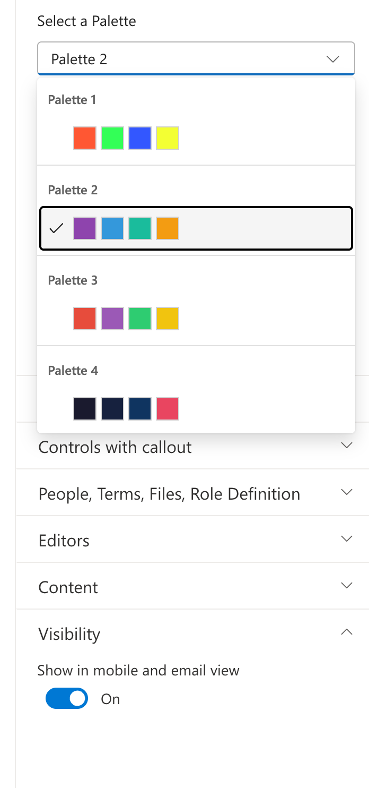
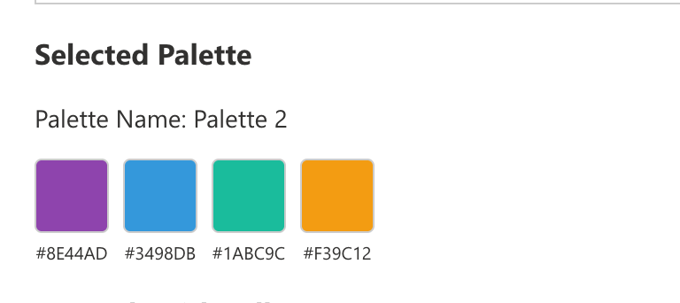

# PropertyPanePalettePicker control

This control generates a palette picker that allows users to select a color palette from a predefined list. Each palette contains a name and an array of colors that can be displayed visually in the property pane.

**PropertyPanePalettePicker example usage**




## How to use this control in your solutions

1. Check that you installed the `@pnp/spfx-property-controls` dependency. Check out the [getting started](../../#getting-started) page for more information about installing the dependency.

2. Import the following modules to your component:

```TypeScript
import { PropertyPanePalettePickerField } from '@pnp/spfx-property-controls/lib/PropertyPanePalettePicker';
```

3. Create new properties for your web part:

```TypeScript
export interface IPropertyControlsTestWebPartProps {
  selectedPalette: string;
  selectedPaletteColors: string[];
}
```

4. Define the palettes as a `Record<string, string[]>`:

```TypeScript
const palettes: Record<string, string[]> = {
  "Palette 1": ["#FF5733", "#33FF57", "#3357FF", "#F3FF33"],
  "Palette 2": ["#8E44AD", "#3498DB", "#1ABC9C", "#F39C12"],
  "Palette 3": ["#E74C3C", "#9B59B6", "#2ECC71", "#F1C40F"],
  "Palette 4": ["#1A1A2E", "#16213E", "#0F3460", "#E94560"]
};
```

5. Add the custom property control to the `groupFields` of the web part property pane configuration:

```TypeScript
PropertyPanePalettePickerField("selectedPalette", {
  key: "palettePicker",
  label: "Select a Palette",
  selectedPalette: this.properties.selectedPalette || "Palette 1",
  palettes: palettes,
  onPropertyChange: (propertyPath: string, newValue: string) => {
    this.properties.selectedPalette = newValue;
  },
  onSelectedPalette: (palette: Record<string, string[]>) => {
    console.log("Selected palette:", palette);
    // palette is a Record<string, string[]> containing the palette name as key and colors array as value
    const paletteName = Object.keys(palette)[0];
    const paletteColors = palette[paletteName];
    this.properties.selectedPalette = paletteName;
    this.properties.selectedPaletteColors = paletteColors;
    this.render();
  }
})
```

## Implementation

The `PropertyPanePalettePickerField` control can be configured with the following properties:

| Property | Type | Required | Description |
| ---- | ---- | ---- | ---- |
| key | string | yes | An unique key that indicates the identity of this control. |
| label | string | yes | Property field label displayed on top. |
| selectedPalette | string | yes | The name of the currently selected palette. |
| palettes | Record<string, string[]> | yes | The collection of palettes to display. Keys are palette names, values are arrays of color hex strings. |
| onPropertyChange | function | yes | Callback function triggered when a palette is selected. Receives the property path and the new palette name. |
| onSelectedPalette | function | no | Callback function that returns the selected palette as a `Record<string, string[]>` object. |
| disabled | boolean | no | Specify if the control needs to be disabled. |
| theme | Theme | no | Fluent UI theme to apply to the control. |

## Palette Data Structure

Palettes are defined using a `Record<string, string[]>` where:
- **Key**: The palette name/identifier (e.g., "Palette 1", "Ocean Theme", "Brand Colors")
- **Value**: An array of CSS-compatible color strings (hex values)

```TypeScript
const palettes: Record<string, string[]> = {
  "Ocean": ["#006994", "#40E0D0", "#0077BE", "#00CED1"],
  "Sunset": ["#FF6B6B", "#FFA07A", "#FFD700", "#FF4500"],
  "Forest": ["#228B22", "#32CD32", "#90EE90", "#006400"]
};
```

## Example: Displaying Selected Palette Colors

You can use the `onSelectedPalette` callback to get the full palette information and display the colors in your web part:

```TypeScript
onSelectedPalette: (palette: Record<string, string[]>) => {
  // Get the palette name (first key)
  const paletteName = Object.keys(palette)[0];
  
  // Get the colors array
  const colors = palette[paletteName];
  
  console.log("Palette name:", paletteName);
  console.log("Colors:", colors);
  
  // Store for rendering
  this.properties.selectedPaletteColors = colors;
  this.render();
}
```

Then in your component, render the colors:

```tsx
<div style={{ display: 'flex', gap: '8px' }}>
  {this.props.selectedPaletteColors.map((color, index) => (
    <div 
      key={index}
      style={{ 
        width: '40px', 
        height: '40px', 
        backgroundColor: color,
        borderRadius: '4px'
      }} 
    />
  ))}
</div>
```


